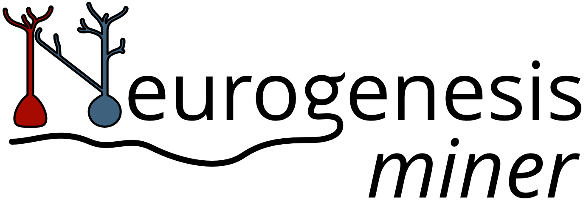

  
     

# NeurogenesisMiner
An interactive text mining tool to assist curation of interaction pathways important in adult neurogenesis

# Web project
The web project is hosted at https://rupertoverall.net/neurogenesis-miner

# Issues/feedback
To report bugs, make feature requests etc., please use the [issues tracker](https://github.com/rupertoverall/NeurogenesisMiner/issues) associated with this repository.

# About this tool
The NeurogenesisMiner project provides access to a database of interactions between genes / proteins, chemicals and biological processes involved in adult neurogenesis with a focus on the hippocampus.

The interactions have been automatically extracted using text mining. The information shown on this site is thus not curated and is intended to be used for semantic searching and as an aid to manual literature curation efforts.

The interactions have been extracted from several sources including preprints from bioRxiv, abstracts from a broad search of [PUBMED](https://pubmed.ncbi.nlm.nih.gov/?orig_db=pubmed&term=%28%28%22adult%20neurogenesis%22%29%20OR%20%28%28adult%20OR%20postnatal%29%20AND%20%28%22stem%22%20OR%20%22progenitor%2A%22%20OR%20%22precursor%2A%22%20OR%20%22new%20born%22%29%29%29%20AND%20%28hippocamp%2A%20OR%20%22dentate%20gyrus%22%20OR%20sgz%20OR%20%22subgranular%22%29%20AND%20%28gene%20OR%20transcript%2A%20OR%20protein%20OR%20rna%20OR%20expression%20OR%20receptor%20OR%20agonist%20OR%20antagonist%20OR%20transgen%2A%20OR%20knock%2A%29) for hippocampal neurogenesis-related molecular interactions, full-text manuscripts of a subset of these PubMed articles that are available via the [PubMed Central Open Access Subset](https://www.ncbi.nlm.nih.gov/pmc/tools/textmining/#oasubset) as well as a collection of hand-selected manuscripts curated as part of the [Adult Neurogenesis Map](https://rupertoverall.net/neurogenesis-map).

This project is run by Rupert Overall (https://rupertoverall.net/, https://twitter.com/rupertoverall)

# Tutorial
A full tutorial can be found at https://rupertoverall.net/neurogenesis-miner/tutorial

# Notes on mapping
The NeurogenesisMiner tool is designed to allow rapid assessment of a large body of literature — it does not aim to provide detailed and accurate interaction information. In order to better serve this aim, it was decided to collapse closely-related entities as much as possible. Specifically, all mentions of genes or gene products (RNA, proteins) are mapped to the corresponding gene identifier. In addition, genes and proteins from different organisms (or where the organism is unclear) are mapped to the homologous mouse gene. This means that potential interactions discovered in closely-related species will be visible when searching for interaction partners of mouse protein identifiers. The resulting links lead to the underlying literature and it is up to the user to decide if and how that information fits into their curation scheme.

Finally, there are many concepts (particularly biological processes) for which there are no good mappings. Where the natural language processing software has detected an entity that cannot be mapped, it will be presented in the network as plain text. Although there is no detailed metadata for such entities, they can often be informative enough to warrant a closer look at the source manuscript. Often, many separate entities with similar names will be present where they should really be collapsed into one. We are working to improve the mapping resources to remedy this problem.
